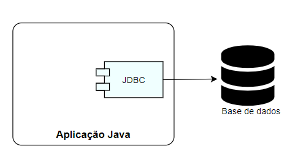
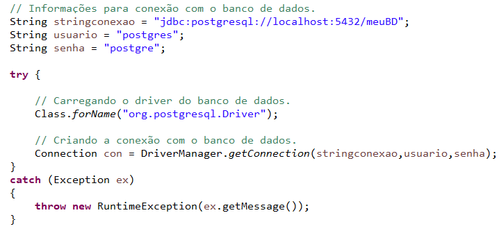
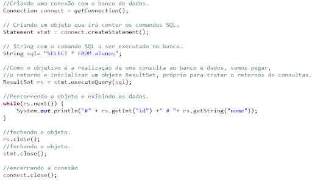
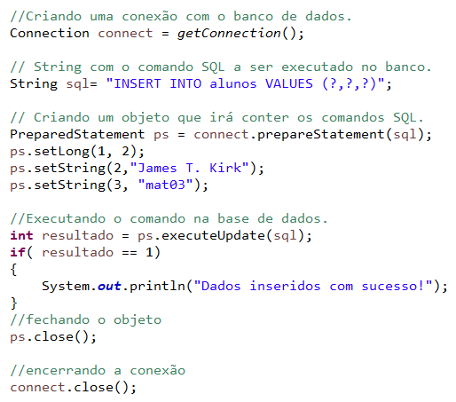
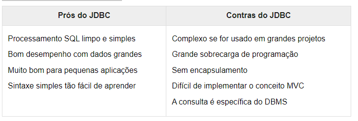

## O que é JDBC?

A JDBC é uma API do Java que possibilita que uma aplicação construída na linguagem consiga acessar um banco de dados 
configurado local ou remotamente. A API é composta pelos pacotes java.sql e javax.sql, incluídos no JavaSE. 
Por meio das classes e interfaces fornecidas por esses dois pacotes, as pessoas podem desenvolver softwares que acessem 
qualquer fonte de dados, desde bancos relacionais até planilhas.

## Componentes

A API JDBC é composta por dois componentes centrais. Em primeiro lugar, podemos falar dos pacotes (Java.sql e Javax.sql) 
que contêm as classes e interfaces que padronizam a comunicação da aplicação Java com uma base de dados.

Outro item importante são os drivers, verdadeiros responsáveis pela conexão e interação com um banco específico. 
Um driver JDBC é uma classe que implementa a interface java.sql.Driver. Muitos drivers são totalmente desenvolvidos 
com o uso de Java, o que colabora para serem carregados de maneira dinâmica.

Os drivers também podem ser escritos de forma nativa, acessando outras bibliotecas ou outros drivers de sistema que 
permitam acesso a uma base de dados determinada.

A classe DriverManager define um conjunto básico de operações para a manipulação do driver adequado para a conexão com 
um banco. Além disso, ela também é responsável por realizar a conexão inicial.

## Usando o JDBC

Agora vamos ver de maneira prática como utilizar o JDBC para implementar uma conexão com uma base de dados. Nos exemplos
abaixo, utilizamos o postgresql como fonte, mas a ideia central pode ser replicada para outros bancos de dados
relacionais.

Como numa receita de bolo, vamos seguir um roteiro básico para a manipulação dos dados. Nossos passos iniciais serão:

- Definir a classe que implementa o driver JDBC, vamos usar org.postgresql.Driver;
- Definir a string de conexão do banco de dados, basicamente uma cadeia de caracteres com informações para conectar. 
- É importante mencionar que a maneira de definir esta string varia entre bancos diferentes. Você pode explorar mais
formas de escrever essas strings acessando ConnectionString;
- Fornecer nome de usuário e senha para nos conectar no banco de dados.

Na figura abaixo, vemos códigos com o passo a passo:

Realizada a conexão com o banco de dados, chega o momento de executar as operações de consulta, inserção, atualização 
e deleção (apagamento) de informações. Temos um conjunto de classes e interfaces já preparados para isso. São elas:

- Connection - Representa uma sessão junto ao banco de dados desejado. Vimos a classe no trecho de código do exemplo
anterior e vamos executar as instruções SQL dentro da conexão estabelecida.
- Statement - Tem como objetivo a execução do comando SQL. Temos também a PreparedStatement, que pré-compila o comando 
e armazena o SQL em um objeto.
- ResultSet - Esta interface tem por objetivo armazenar o retorno de uma consulta realizada no banco de dados. As 
- informações das tabelas são recuperadas na sequência e podem ser iteradas em loops para a manipulação.

Vamos agora visualizar a escrita de uma consulta usando os recursos JDBC.

Agora veremos os códigos para a escrita das operações de insert, update e delete . O exemplo mostra um INSERT, mas a
lógica será a mesma para as demais ações.

No fim, podemos definir os seguintes passos para usar o JDBC:

- Realizar o carregamento do driver do banco.Class.forName("org.postgresql.Driver").

- Criar a conexão com o banco. DriverManager.getConnection(stringconexao,usuario,senha).

- Preparar o comando a ser executado no banco. String sql="SELECT FROM alunos"*

- Executar o comando. Neste ponto, vale a pena ficarmos atentos: quando se trata de uma consulta, usamos executeQuery, 
quando se trata de um insert, update ou delete, usamos executeUpdate

- Tratar o resultado. Quando for o retorno de uma consulta (ResultSet), vamos iterar o objeto. Se for o retorno de insert,
update ou delete, devemos avaliar o valor retornado.

## DAO

É muito importante usar no JDBC;

## Prós e contras do JDBC

